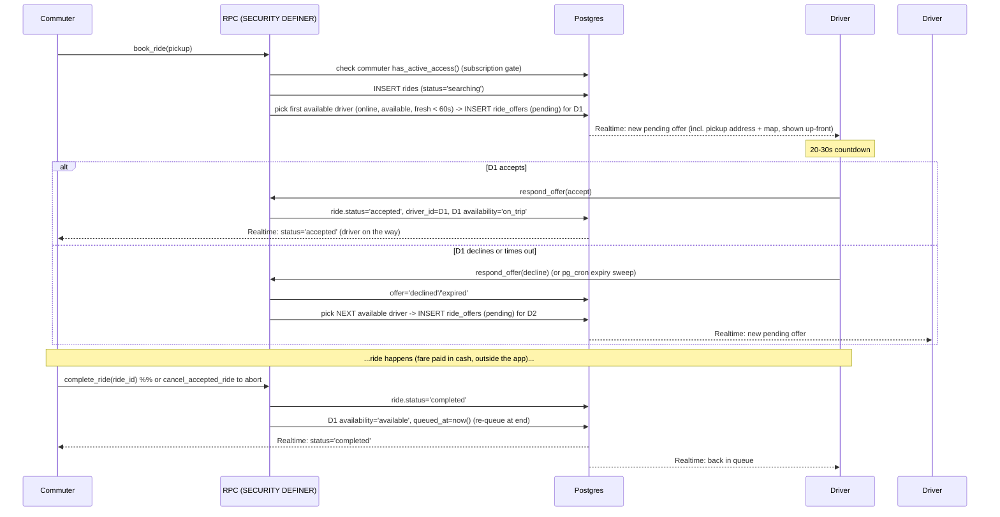

# Architecture

> **Scope reminder:** MotoQueue is a **dispatch-only** app for franchised tricycles — it connects commuter ↔ driver
> and nothing more. It does **not** process **fares** (cash, paid to the driver outside the app) or **destinations**.
> Revenue comes from a flat **₱30/month subscription** (see [`MONETIZATION.md`](MONETIZATION.md)), not from rides.
> Regulatory framing: [`LEGAL.md`](LEGAL.md).

## System overview

```
        ┌──────────────────────────┐         ┌──────────────────────────┐
        │   Commuter PWA (React)   │         │    Driver PWA (React)    │
        │  map · booking · status  │         │  online toggle · offers  │
        └────────────┬─────────────┘         └─────────────┬────────────┘
                     │  HTTPS + WebSocket (Supabase JS)     │
                     └───────────────┬──────────────────────┘
                                     ▼
                ┌─────────────────────────────────────────────┐
                │                  Supabase                    │
                │                                              │
                │  Auth  ──  Postgres (RLS)  ──  Realtime      │
                │                  ▲                           │
                │                  │ rpc()                     │
                │        ┌─────────┴───────────────┐           │
                │        │ SECURITY DEFINER funcs   │          │
                │        │ book_ride · respond_offer│          │
                │        │ complete_ride · cancel…  │          │
                │        │ get_counterpart · sweep  │          │
                │        └──────────────────────────┘          │
                │                                              │
                │  ride_offers INSERT ─► DB Webhook ─►         │
                │      Edge Function: notify-driver ───┐       │
                └──────────────────────────────────────┼──────┘
                                                        ▼
                                         Web Push service ─► Driver service worker
                                         (ride-offer push, even app-closed)

   Frontend deployed on Vercel (static PWA); backend is hosted Supabase.
   External: OpenStreetMap tiles (called from the client); a Web Push service
   (delivers offer pushes via notify-driver). No geocoding service.
```

**Principle:** the client renders and reads; anything that touches **access (subscriptions/renewals)** or **queue
fairness** goes through a **Postgres `SECURITY DEFINER` function** (called via `supabase.rpc()`), which runs as the
table owner after checking `auth.uid()`. Clients never extend their own `subscription_until`, approve their own
renewal, or pick the next driver directly — RLS forbids it. (The app never touches **fares** — those are cash, paid
to the driver outside the app.)

## Component responsibilities

| Component | Responsibility |
|-----------|----------------|
| **Commuter PWA** | Type pickup address + pin current location, call `book_ride` (gated on an active subscription), watch the ride live, see the driver's live location + chat after accept, call `complete_ride` / `cancel_accepted_ride`. Renew via `RenewPanel` when access lapses. On a `no_drivers` result, arm a watch (`useAvailableDrivers`) that alerts + offers one-tap re-book when a driver comes online. |
| **Driver PWA** | Toggle online (join/leave queue; gated on an active subscription), heartbeat while online, receive offers **with the pickup address + map up-front**, Accept/Decline (`respond_offer`), chat + stream GPS while on a trip (and see their **own** GPS on the trip map), `complete_ride` / `cancel_accepted_ride`. Opt into **ride-offer push** so offers arrive even when the app is closed. |
| **Supabase Auth** | Identity (phone → synthetic email); `auth.uid()` powers RLS. |
| **Postgres + RLS** | Source of truth. Users see only rows they're entitled to. |
| **Supabase Storage** | Private `renewal-screenshots` bucket (per-user folders); the admin views proof via short-lived **signed URLs**. |
| **Realtime** | Pushes offers to drivers, ride status to commuters, queue + driver location to both, chat messages, and renewal-status changes. |
| **SECURITY DEFINER functions** | Trusted dispatch, queue ordering, subscription gating, and renewal review (`submit_renewal`/`review_renewal`). |
| **`notify-driver` Edge Function** | The app's **only** Edge Function, and **outbound-only**: triggered by a Database Webhook on `ride_offers` INSERT, it reads the offered driver's `push_subscriptions` (service role) and sends a VAPID **Web Push** so the offer reaches the driver even when the app is closed / phone locked. No dispatch or trust logic lives here — that stays in the RPCs. |

## The queue

The queue is **implicit**, not a separate ordered table. A driver is "in the queue" when:

```
driver_states.is_online = true AND availability = 'available'
```

Order is **FIFO by `queued_at` ascending**. Mutations:

- **Go online** → `is_online=true`, `availability='available'`, `queued_at = now()` → joins the back. *(Rejected if
  the driver's subscription is expired — see access gating.)*
- **Offered a ride** → still `available` until they respond (offers don't remove them from order, so a decline keeps
  their place).
- **Accept** → `availability='on_trip'` → effectively leaves the queue.
- **Complete** → `availability='available'`, **`queued_at = now()`** → re-joins at the **back** (fairness rule).
- **Cancel-after-accept** → same re-queue (the driver is freed back to `available`).
- **Go offline** → `availability='offline'`.

> **Dispatch eligibility (liveness).** `_offer_to_next_driver` only offers to drivers whose `updated_at` is within the
> last **60s**, so a closed/disconnected tab stops getting offers. A live client keeps itself fresh via the
> `driver_heartbeat()` RPC (the client pings it on going online + every 25s). `reap_stale_drivers()` can mark stale
> drivers offline for the queue *display*; it's optional (pg_cron) — dispatch is already correct via the 60s filter.

> **Implementation note (Phase 5).** The dispatch logic was built as **Postgres `SECURITY DEFINER`
> functions (RPC)** — `book_ride`, `respond_offer`, `cancel_ride`, `cancel_accepted_ride`, `get_counterpart`,
> `expire_stale_offers`, and the internal `_offer_to_next_driver` — rather than Edge Functions. Same trust boundary
> (`security definer` + `auth.uid()` checks; RLS still blocks direct table writes), but no CLI/Docker to deploy,
> atomic transactions, and the timeout sweep reuses the same dispatch routine. The flow below is unchanged; in the
> diagram "RPC (SECURITY DEFINER)" = these functions. *(The app does now have exactly **one** Edge Function,
> `notify-driver`, but it carries no dispatch/trust logic — it only fans a ride offer out as a Web Push. See the PWA &
> notifications section.)*

## Dispatch flow (the heart of the app)



### Offer timeout & next-driver fallback

- **Primary UX:** the driver's offer card shows a **20–30s countdown**. Letting it hit zero (or tapping Decline)
  calls `respond_offer` with `decline`, which marks the offer and dispatches the next driver.
- **Safety net:** a `pg_cron` job (or an expiry check inside `respond_offer`) sweeps for `pending` offers older than
  the timeout and expires them + advances the queue — so a driver who closes the tab can't stall a ride forever.
- **No drivers left:** if there is no next available driver, the ride is set to `no_drivers`. The commuter can retry,
  or arm a watch (`useAvailableDrivers`, live on `driver_states`) that alerts them and offers a **one-tap re-book**
  (reusing the pinned pickup) the moment a driver comes online — in-app via the Notifications API; for a closed app
  this is the job of the ride-offer Web Push (below).

## Fares & money

The app **does not touch fares.** The ride fare is paid in **cash, directly to the driver, outside the app** — the app
never sees the amount. (Historical note: an early MVP charged a 5+5 **credit** fee per ride; per-ride credits and the
`transactions` ledger were **removed in `0008`** when the subscription model landed.) Revenue is the subscription
below — never a per-ride charge.

## Subscriptions & access gating ✅ _(built `0008`–`0010` — see [`MONETIZATION.md`](MONETIZATION.md))_

Revenue is a flat **₱30/month subscription** for both sides, **not** a per-ride charge. It **gates access**, and is
deliberately kept **closed-loop** (redeemable only for app access, never used to pay the driver) so it stays clear of
BSP e-money regulation.

- **Access check.** `profiles.subscription_until` is the gate, via the `has_active_access(uid)` helper. `book_ride`
  (commuter) and `driver_go_online` (driver) reject when the subscription is expired, honoring a **3-day grace**.
  First month is free for both (stamped at signup in `handle_new_user`).
- **Manual GCash renewal.** The app shows a **business GCash number**; the user pays externally, then submits the
  **GCash reference number** (+ optional screenshot, stored in a private bucket) via `submit_renewal`, creating a
  `pending` `renewals` row. Ref numbers are **UNIQUE** (duplicates auto-rejected); a second pending submission is
  blocked; a rejected user can resubmit.
- **Admin review.** An `is_admin` flag + the `/admin` page lists pending renewals; the admin **cross-checks the ref
  against the GCash transaction history**, then calls `review_renewal(id, 'approve'|'reject', reason)` — a SECURITY
  DEFINER function that checks `is_admin()` **inside**, and on approve extends `subscription_until` by a month
  (stacking onto remaining time). The same `is_admin` role + signed-URL machinery is reserved for the planned driver
  verification.
- **No money moves through the app.** GCash handles the actual peso transfer; MotoQueue only records the claim and an
  admin confirms it. There is still **no payment processor** in this app. *(There is one server-side secret now — the
  Supabase **service-role key** — but it lives only in the `notify-driver` Edge Function's environment, used to read
  `push_subscriptions` when sending a push. It is never shipped to the client.)*

## Realtime channels

| Subscriber | Listens to | Reacts by |
|-----------|------------|-----------|
| Driver | `ride_offers` for me | Show Accept/Decline card |
| Driver | `rides` where `driver_id = me` | Show trip panel; toggle queue availability |
| Commuter | `rides` where `client_id = me` | Update status UI (searching → accepted → completed / no_drivers) |
| Commuter (active ride) | `driver_states` (driver's location) | Move the driver marker on the live map |
| Both (active ride) | `messages` for the ride | Append new chat messages |
| Anyone on queue screen | `driver_states` changes | Update live online count / position |
| Commuter (no-drivers watch) | `driver_states` changes | Alert + offer one-tap re-book when a driver becomes available |
| Any signed-in user | `profiles` (own row) | Update the subscription badge live (e.g. after a renewal is approved) |
| Any signed-in user | `renewals` for me | Flip the renewal status (pending → approved/rejected) in place |
| Admin | `renewals` (all) | Refresh the pending-review queue as submissions arrive |

## PWA & notifications

The frontend is an installable PWA (built with `vite-plugin-pwa`) deployed as a static bundle on Vercel.

- **Install & update.** `usePwaInstall` / `InstallBanner` capture the browser's install prompt (with an iOS
  Add-to-Home-Screen fallback). The service worker uses the **`prompt`** update strategy: a new build surfaces a
  "Reload" banner (`ReloadPrompt`, via `useRegisterSW`) instead of silently swapping, so it's explicit which version
  is live. A small **build-id footer** (`__BUILD_ID__`, injected from the Vercel commit SHA via Vite `define`) makes
  the running version visible at a glance.
- **Ride-offer Web Push (closed-app / locked-phone).** Drivers opt in (`usePushNotifications` / `RideAlertsToggle`),
  which stores their browser push subscription in the **`push_subscriptions`** table (`0012`; one row per device,
  user-scoped by RLS). When `_offer_to_next_driver` inserts a `ride_offers` row, a Supabase **Database Webhook** (on
  `ride_offers` INSERT) POSTs to the **`notify-driver`** Edge Function with a shared `x-webhook-secret` header. The
  function (VAPID keys + service role) looks up that driver's subscriptions and sends a Web Push; the service worker's
  push handlers (`public/push-sw.js`, pulled into the generated SW via `workbox.importScripts`) show the notification
  even with the app fully closed, and pruning removes dead subscriptions (404/410).
- **iOS caveat.** Web Push on iOS works **only for an installed PWA** (Add to Home Screen, iOS 16.4+) — never in a
  Safari tab — so drivers must install the app to receive offers when it's closed.

This Web Push path is the **one** place trusted server logic reaches outside Postgres; everything access- or
fairness-related still lives in the RPCs.

## Trust & security

- **RLS on every table.** A user can read/write only rows they're entitled to (own row, ride participant, etc.);
  admins additionally read all `profiles` + `renewals` (via the SECURITY DEFINER `is_admin()` helper, which avoids
  RLS recursion).
- `subscription_until`, `is_admin`, queue ordering, ride-status transitions, and `renewals.status` are **never**
  writable from the client — only the `SECURITY DEFINER` functions touch them.
- Those functions check `auth.uid()` (and `is_admin()` for review actions, and that the caller owns the ride/offer
  they're acting on) before doing anything.
- Chat inserts and driver-location updates go direct from the client but are constrained by RLS / a self-only RPC.
  Renewal screenshots live in a **private** Storage bucket (per-user folder); reads are owner-or-admin via signed URLs.
- `push_subscriptions` rows are **user-scoped by RLS** (you only ever touch your own). The `notify-driver` Edge
  Function reads them with the **service-role key** (server-only) and is itself gated by a shared `x-webhook-secret`,
  so only the Database Webhook can invoke it.

See [`DATA_MODEL.md`](DATA_MODEL.md) for the concrete schema and RLS policies.
